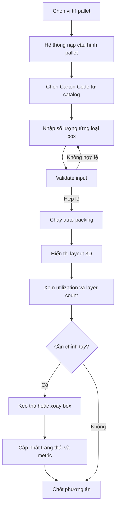
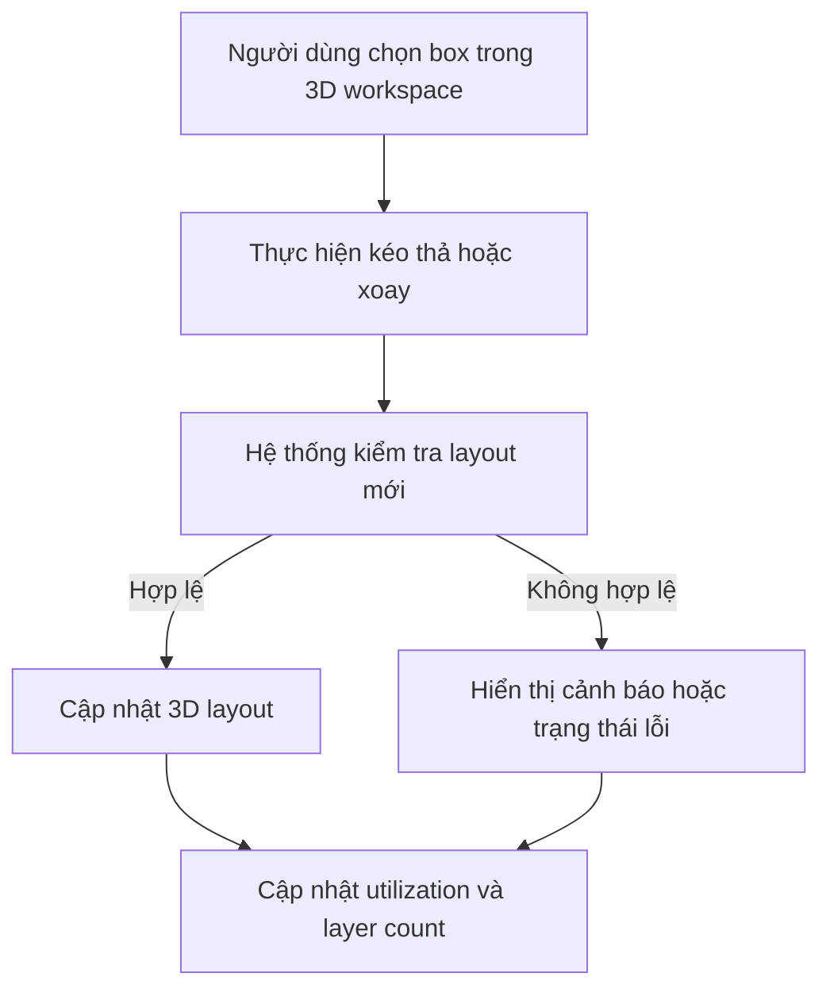

# Functional Requirements Document

## 1. Metadata

- Project: TimeX
- Slug: `timex`
- Date set: `260331-1833`
- Source backbone: `plans/reports/backbone-260331-1833-timex.md`
- Mode: `hybrid`
- Platform: Web app POC
- Ngôn ngữ: Tiếng Việt

## 2. Functional Overview

TimeX là web app POC hỗ trợ nhân viên kho tạo phương án xếp hộp vào pallet bằng cách kết hợp catalog box chuẩn, auto-packing algorithm, và mô hình 3D để quan sát và chỉnh sửa kết quả. Mục tiêu của hệ thống là cung cấp một luồng thao tác ngắn, dễ hiểu, giảm thử-sai thủ công và tăng khả năng sử dụng không gian pallet.

Luồng chính của sản phẩm đi theo hướng:

1. Chọn pallet context theo vị trí.
2. Chọn box từ catalog chuẩn theo `Carton Code`.
3. Nhập số lượng theo từng loại box.
4. Chạy auto-packing để sinh layout gợi ý.
5. Xem layout trên 3D workspace.
6. Chỉnh tay bằng kéo thả, xoay box nếu cần.
7. Đánh giá kết quả qua utilization, layer count, và trạng thái hợp lệ.

## 3. User Personas

### Persona 1. Nhân viên kho

- Vai trò: người dùng chính
- Mục tiêu: tạo nhanh phương án xếp khả thi và dễ hình dung
- Pain point hiện tại:
  - khó ước lượng không gian pallet bằng mắt
  - mất thời gian thử nhiều phương án
  - khó phát hiện sớm phương án không hợp lệ

### Persona 2. Lead kho / vận hành

- Vai trò: người xem xét nghiệp vụ
- Mục tiêu: đánh giá POC có giúp thao tác nhất quán và giảm sai sót hay không
- Nhu cầu: thấy rõ logic đề xuất, metric kết quả, và mức dễ dùng của giao diện

## 4. Feature List With MoSCoW Priorities

| ID | Feature | Priority | Mô tả |
| --- | --- | --- | --- |
| FEAT-01 | Chọn vị trí pallet | Must | Người dùng chọn context pallet để hệ thống nạp đúng giới hạn |
| FEAT-02 | Nạp cấu hình pallet cố định | Must | Hệ thống tự nạp kích thước và chiều cao tối đa theo vị trí |
| FEAT-03 | Catalog box chuẩn theo `Carton Code` | Must | Hiển thị và dùng danh mục box cố định làm nguồn dữ liệu chính |
| FEAT-04 | Nhập số lượng box theo loại | Must | Cho phép nhập số lượng cho một hoặc nhiều loại box |
| FEAT-05 | Validate input | Must | Chặn dữ liệu thiếu, sai định dạng, hoặc không hợp lệ |
| FEAT-06 | Auto-packing | Must | Sinh một phương án xếp khởi tạo ưu tiên utilization |
| FEAT-07 | 3D visualization | Must | Hiển thị layout xếp bằng mô hình 3D |
| FEAT-08 | Zoom / rotate / select | Must | Cho phép người dùng quan sát layout từ nhiều góc nhìn |
| FEAT-09 | Manual drag-and-drop | Should | Cho phép kéo thả box trong workspace |
| FEAT-10 | Manual rotate | Should | Cho phép xoay box khi cần điều chỉnh |
| FEAT-11 | Recalculate validation metrics | Should | Cập nhật metric và trạng thái sau chỉnh tay |
| FEAT-12 | Reset về phương án auto-pack | Could | Hoàn nguyên về layout gợi ý ban đầu |
| FEAT-13 | Nhập box ngoài catalog | Won't | Không cam kết trong scope POC hiện tại |

## 5. Workflows

### 5.1 Luồng chính tạo phương án xếp

### 5.2 Luồng chỉnh tay layout

## 6. Data Requirements

### 6.1 Pallet Position

| Field | Type | Mô tả |
| --- | --- | --- |
| position_code | String | Mã vị trí pallet |
| position_name | String | Tên hiển thị vị trí |
| max_height_cm | Number | Chiều cao tối đa theo vị trí |
| pallet_length_cm | Number | Chiều dài pallet |
| pallet_width_cm | Number | Chiều rộng pallet |

### 6.2 Box Catalog

| Field | Type | Mô tả |
| --- | --- | --- |
| carton_code | String | Mã carton duy nhất |
| description | String | Tên mô tả box |
| length_cm | Number | Chiều dài chuẩn |
| width_cm | Number | Chiều rộng chuẩn |
| height_cm | Number | Chiều cao chuẩn |
| volume_weight_kg | Number | Dữ liệu tham chiếu logistics |
| annual_volume | Number | Dữ liệu tham chiếu nghiệp vụ |
| annual_volume_weight_kg | Number | Dữ liệu tham chiếu nghiệp vụ |
| freight_cost_usd | Number | Dữ liệu tham chiếu nghiệp vụ |

### 6.3 Packing Request

| Field | Type | Mô tả |
| --- | --- | --- |
| pallet_position | String | Vị trí pallet được chọn |
| box_items | Array | Danh sách loại box và số lượng |
| selected_metric_goal | String | Objective hiện hành, mặc định là utilization |

### 6.4 Packing Result

| Field | Type | Mô tả |
| --- | --- | --- |
| layout_id | String | Mã layout kết quả |
| boxes | Array | Danh sách box với tọa độ, orientation, layer |
| utilization_percent | Number | Tỷ lệ sử dụng thể tích pallet |
| layer_count | Number | Số layer trong layout |
| validation_state | String | Trạng thái hợp lệ hoặc không hợp lệ |

## 7. Business Rules

- BR-01: Người dùng phải chọn một vị trí pallet trước khi chạy auto-packing.
- BR-02: Hệ thống phải sử dụng kích thước pallet và giới hạn chiều cao tương ứng với vị trí đã chọn.
- BR-03: Khi chọn box từ catalog chuẩn, kích thước phải lấy từ master data theo `Carton Code`.
- BR-04: Dữ liệu số lượng box phải hợp lệ trước khi chạy thuật toán.
- BR-05: Layout xếp không được vượt quá giới hạn chiều dài, chiều rộng, hoặc chiều cao pallet.
- BR-06: `Utilization` là mục tiêu đánh giá chính cho phương án auto-pack trong POC.
- BR-07: Sau khi người dùng chỉnh tay layout, hệ thống phải cập nhật lại trạng thái hợp lệ và metric.
- BR-08: `Volume weight`, `annual volume`, và `freight cost` hiện là dữ liệu tham chiếu, không phải objective tối ưu bắt buộc của POC.

## 8. Integration Points

### Tích hợp trong phạm vi POC

- Frontend web app với module auto-packing nội bộ.
- Frontend web app với module 3D visualization nội bộ.

### Không tích hợp trong phạm vi POC

- WMS
- ERP
- Thiết bị kho hiện trường
- Dịch vụ tối ưu logistics bên thứ ba

### Integration notes

- FRD giả định module auto-packing được gọi trong cùng solution boundary, không cần tích hợp hệ thống ngoài.
- Catalog box có thể được seed từ static dataset hoặc nguồn quản trị nội bộ tối giản.

## 9. Acceptance Criteria By Feature

| Feature ID | Acceptance criteria |
| --- | --- |
| FEAT-01, FEAT-02 | Người dùng chọn vị trí pallet và hệ thống hiển thị đúng cấu hình pallet áp dụng. |
| FEAT-03, FEAT-04 | Người dùng chọn được một hoặc nhiều `Carton Code` và nhập được số lượng tương ứng. |
| FEAT-05 | Input không hợp lệ bị chặn và có phản hồi rõ ràng trước khi chạy thuật toán. |
| FEAT-06 | Hệ thống sinh được ít nhất một layout khả thi trong phạm vi dữ liệu POC. |
| FEAT-07, FEAT-08 | Layout được hiển thị trong 3D workspace và người dùng có thể zoom, rotate, chọn box. |
| FEAT-09, FEAT-10 | Người dùng có thể kéo thả hoặc xoay box ở mức POC trên layout đã sinh. |
| FEAT-11 | Sau chỉnh tay, utilization, layer count, và validation state được cập nhật lại. |
| FEAT-12 | Nếu được triển khai, người dùng có thể quay về layout auto-pack ban đầu mà không cần nhập lại dữ liệu. |

## 10. Non-functional Notes

- POC ưu tiên sự rõ ràng của luồng thao tác hơn là độ phức tạp thuật toán.
- Giao diện phải tối giản, dễ hiểu cho nhân viên kho.
- 3D workspace phải đủ mượt để phục vụ kiểm tra trực quan, không cần mức fidelity cao như CAD.

## 11. Dependencies And Risks

### Dependencies

- Danh sách vị trí pallet hỗ trợ trong UI phải được chốt.
- Catalog box chuẩn phải được seed chính xác.
- Thuật toán packing và 3D visualization phải dùng cùng một cấu trúc dữ liệu layout.

### Risks

- Chưa có KPI định lượng nên khó đánh giá mức thành công tuyệt đối của POC.
- Nếu manual adjustment quá tự do, validation logic có thể phức tạp hơn dự kiến.
- Nếu cần hỗ trợ box ngoài catalog sớm, scope input và validation sẽ tăng đáng kể.

## 12. Recommended Next Documents

- `user stories`: chuyển feature map thành epic/story và acceptance criteria kiểu Given/When/Then.
- `srs`: đặc tả chọn lọc cho use case, screen contract lite, validation rules, và trạng thái của 3D workspace.
