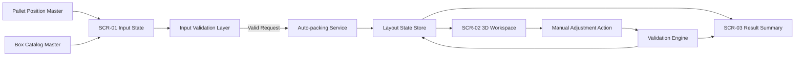
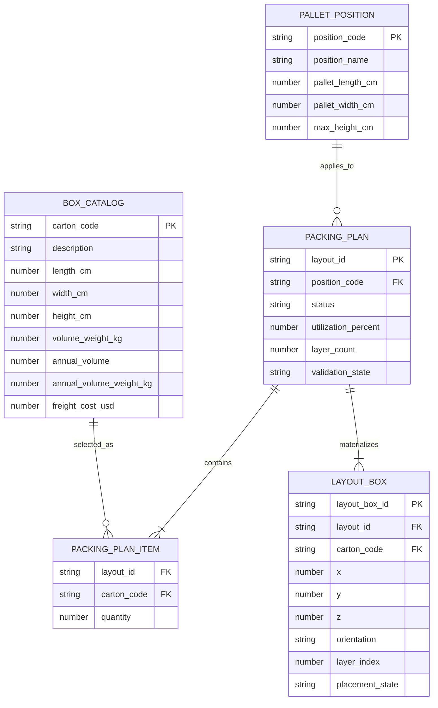

# SRS Group D - Technical

## 1. Metadata

- Project: TimeX
- Slug: `timex`
- Date set: `260331-1833`
- Mode: `hybrid`
- Scope: selective technical slice for validation, packing flow, and UI-backed implementation

## 2. Non-functional Requirements

| NFR ID | Requirement | Verification approach |
| --- | --- | --- |
| `NFR-01` | UI phải đủ đơn giản để nhân viên kho thao tác với training tối thiểu. | Review wireframe + UAT walkthrough |
| `NFR-02` | 3D visualization phải phản hồi mượt ở mức đủ dùng trên desktop browser hiện đại. | Smoke test với dataset POC |
| `NFR-03` | Hệ thống phải ngăn input sai định dạng hoặc vượt phạm vi hợp lệ. | Validation test cases |
| `NFR-04` | Auto-packing phải trả kết quả trong thời gian hợp lý cho dữ liệu POC. | Performance observation trong UAT |
| `NFR-05` | Catalog box chuẩn phải nhất quán và không phát sinh mapping sai theo `Carton Code`. | Seed data review + regression test |
| `NFR-06` | Tên field, đơn vị đo, và label phải nhất quán giữa input, result, workspace. | Cross-screen copy review |
| `NFR-07` | Packing engine và UI state phải đủ tách biệt để thay heuristic sau POC. | Architecture review |

## 3. Data Flow Diagram



## 4. Conceptual ERD



## 5. API Specifications

### 5.1 `GET /api/pallet-positions`

Purpose:

- Lấy danh sách vị trí pallet cho `SCR-01`.

Response fields:

- `position_code`
- `position_name`
- `pallet_length_cm`
- `pallet_width_cm`
- `max_height_cm`

### 5.2 `GET /api/box-catalog`

Purpose:

- Lấy catalog box chuẩn cho tìm kiếm và chọn `Carton Code`.

Query notes:

- Có thể hỗ trợ filter theo `carton_code` hoặc text search.

Response fields:

- `carton_code`
- `description`
- `length_cm`
- `width_cm`
- `height_cm`
- `volume_weight_kg`
- `annual_volume`
- `annual_volume_weight_kg`
- `freight_cost_usd`

### 5.3 `POST /api/packing-plans`

Purpose:

- Tạo baseline layout từ request hợp lệ.

Request payload:

```json
{
  "pallet_position": "POS-A1",
  "box_items": [
    {
      "carton_code": "CARTON-01",
      "quantity": 12
    }
  ],
  "selected_metric_goal": "utilization"
}
```

Response payload:

```json
{
  "layout_id": "LAY-001",
  "validation_state": "valid",
  "utilization_percent": 86.4,
  "layer_count": 4,
  "boxes": [
    {
      "layout_box_id": "LB-001",
      "carton_code": "CARTON-01",
      "x": 0,
      "y": 0,
      "z": 0,
      "orientation": "LWH",
      "layer_index": 1
    }
  ]
}
```

### 5.4 `POST /api/packing-plans/{layout_id}/revalidate`

Purpose:

- Tính lại `validation_state`, `utilization_percent`, và `layer_count` sau manual adjustment.

Request notes:

- Request gửi full layout hiện hành hoặc delta placement theo quyết định implementation.

### 5.5 `POST /api/packing-plans/{layout_id}/reset`

Purpose:

- Lấy lại baseline layout của phiên hiện hành.

## 6. Constraints

- Không yêu cầu persistence dài hạn trong phạm vi POC.
- Không yêu cầu optimistic sync giữa nhiều người dùng.
- `volume_weight` và `freight_cost` chỉ hiển thị tham chiếu, không phải input thuật toán bắt buộc.
- Nếu manual adjustment được triển khai tự do, mọi thay đổi vẫn phải đi qua validation engine trước khi đánh dấu `valid`.
- SRS này giả định mọi đơn vị đo chiều dài dùng `cm` và metric hiển thị dưới dạng phần trăm hoặc số nguyên.

