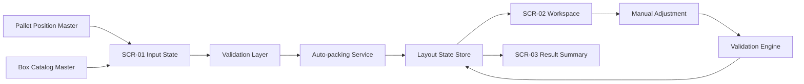
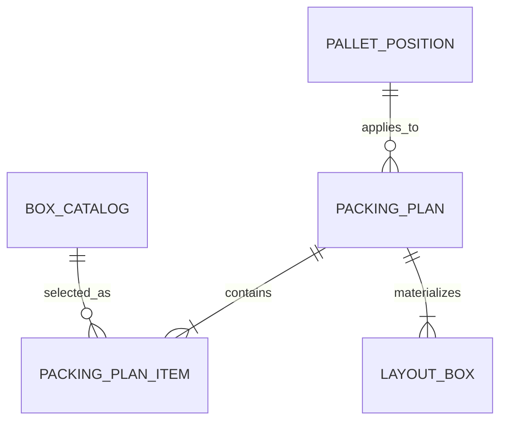
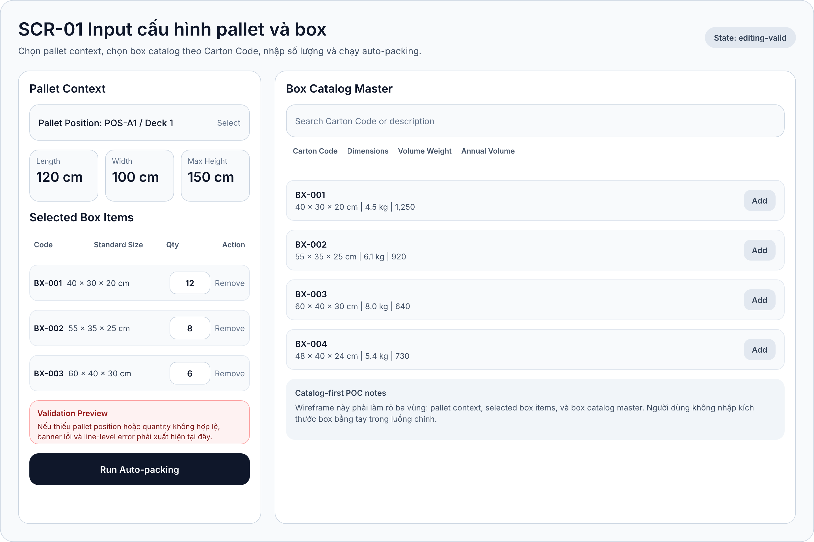
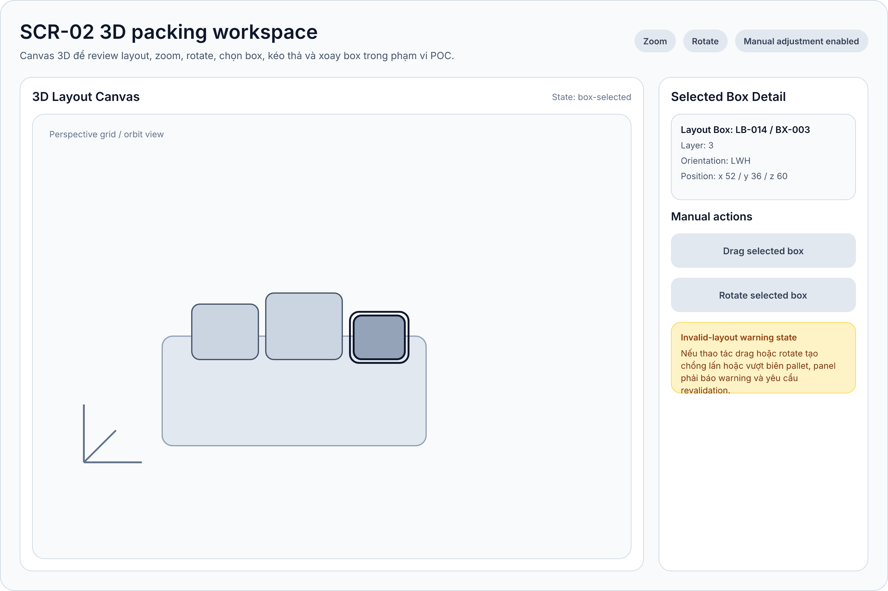
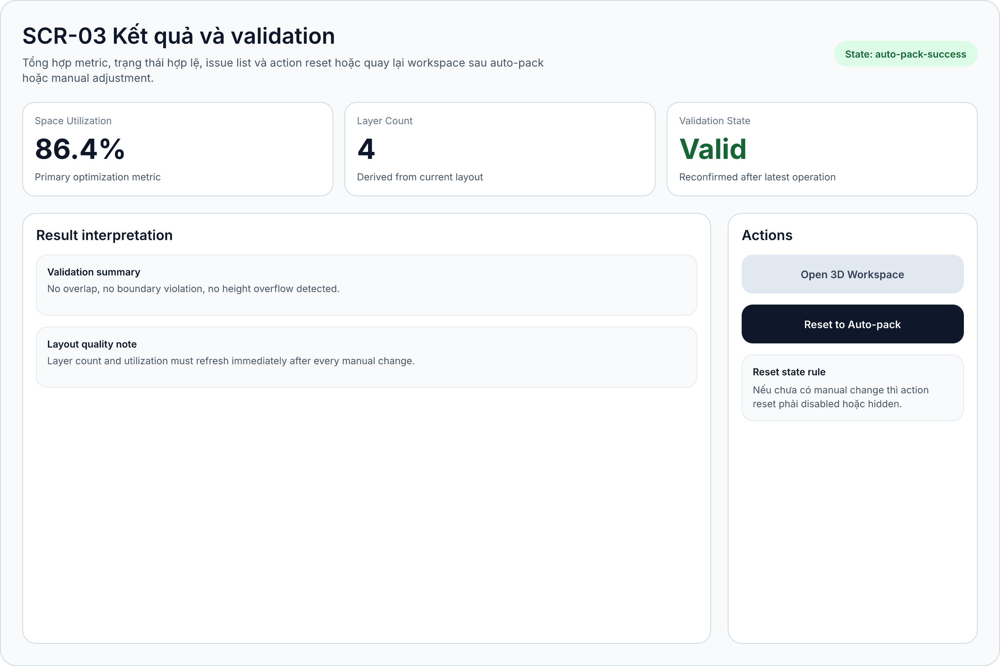

# Software Requirements Specification

## 1. Metadata

- Project: TimeX
- Slug: `timex`
- Date set: `260331-1833`
- Mode: `hybrid`
- Platform: Web app POC
- Output language: Tiếng Việt
- Source backbone: `plans/reports/backbone-260331-1833-timex.md`
- Source user stories: `plans/reports/user-stories-260331-1833-timex.md`
- Source FRD: `plans/reports/frd-260331-1833-timex.md`

## 2. Purpose And Scope

Tài liệu này mô tả đặc tả phần mềm chọn lọc cho POC TimeX, tập trung vào luồng `catalog-first` để xếp box chuẩn lên pallet bằng auto-packing và 3D workspace. SRS này dùng để handoff cho implementation, wireframing, và validation/UAT.

In-scope:

- Chọn vị trí pallet và nạp pallet constraints theo vị trí.
- Chọn `Carton Code` từ catalog chuẩn và nhập số lượng theo loại.
- Validate request trước khi chạy packing.
- Sinh baseline layout bằng auto-packing.
- Review layout qua 3D workspace.
- Manual adjustment bằng drag/drop và rotate ở mức POC.
- Hiển thị `space utilization`, `layer count`, `validation state`.
- Reset về baseline auto-pack.

Out-of-scope:

- Box ngoài catalog chuẩn.
- WMS/ERP integration.
- User management và persistence dài hạn.
- Multi-objective optimization logistics.

## 3. Overall Description

TimeX là web app POC cho nhân viên kho. Hệ thống nhận pallet position và selected box items từ catalog chuẩn, sau đó tính toán layout gợi ý khả thi. Người dùng kiểm tra kết quả qua 3D workspace, chỉnh tay nếu cần và dùng metric để đánh giá kết quả.

Actors:

| Actor | Role |
| --- | --- |
| Nhân viên kho | Người dùng chính thao tác từ input đến review layout |
| Lead kho / vận hành | Reviewer nghiệp vụ cho POC |
| Auto-packing service | Tính toán layout baseline |
| Validation engine | Revalidate layout sau manual change |

Assumptions:

- Dữ liệu pallet position và box catalog được seed nội bộ.
- Người dùng thao tác trên desktop browser.
- `volume weight`, `annual volume`, `annual volume weight`, `freight cost` chỉ dùng tham chiếu.

## 4. Functional Requirements

| FR ID | Requirement | Priority | Stories | Screens |
| --- | --- | --- | --- | --- |
| `FR-01` | Chọn vị trí pallet áp dụng | Must | `US-01` | `SCR-01` |
| `FR-02` | Nạp kích thước pallet và giới hạn chiều cao theo vị trí | Must | `US-01` | `SCR-01` |
| `FR-03` | Cung cấp catalog box chuẩn theo `Carton Code` | Must | `US-02` | `SCR-01` |
| `FR-04` | Chọn nhiều loại box trong cùng request | Must | `US-02`, `US-03` | `SCR-01` |
| `FR-05` | Nhập số lượng theo từng loại box | Must | `US-03` | `SCR-01` |
| `FR-06` | Tự nạp kích thước box từ catalog | Must | `US-02` | `SCR-01` |
| `FR-07` | Validate request trước khi chạy auto-pack | Must | `US-04` | `SCR-01` |
| `FR-08` | Sinh layout auto-packing khả thi | Must | `US-05` | `SCR-01`, `SCR-02`, `SCR-03` |
| `FR-09` | Ưu tiên utilization cho baseline layout | Must | `US-05` | `SCR-03` |
| `FR-10` | Hiển thị layout dạng 3D | Must | `US-07` | `SCR-02` |
| `FR-11` | Hỗ trợ zoom và rotate trong workspace | Must | `US-07` | `SCR-02` |
| `FR-12` | Hỗ trợ chọn box trong workspace | Must | `US-08` | `SCR-02` |
| `FR-13` | Hỗ trợ drag/drop box | Should | `US-09` | `SCR-02` |
| `FR-14` | Hỗ trợ rotate box | Should | `US-10` | `SCR-02` |
| `FR-15` | Cập nhật metric và trạng thái sau manual change | Should | `US-09`, `US-10`, `US-11` | `SCR-02`, `SCR-03` |
| `FR-16` | Hiển thị `space utilization` và `layer count` | Must | `US-06`, `US-11` | `SCR-03` |
| `FR-17` | Reset về baseline auto-pack | Could | `US-12` | `SCR-03` |

## 5. Use Case Specifications

### UC-01 Configure Packing Request

- Actor: Nhân viên kho
- Linked stories: `US-01` đến `US-04`
- Linked screens: `SCR-01`
- Precondition: app mở thành công, master data sẵn sàng
- Postcondition: request hợp lệ sẵn sàng gửi sang auto-packing

Main flow:

1. Người dùng chọn pallet position.
2. Hệ thống nạp pallet constraints.
3. Người dùng tìm và chọn các `Carton Code`.
4. Hệ thống thêm selected box items với kích thước chuẩn.
5. Người dùng nhập quantity theo từng loại box.
6. Người dùng bấm `Run Auto-packing`.
7. Hệ thống validate toàn bộ request trước khi chuyển sang `UC-02`.

Alternate flows:

- Thiếu pallet position: chặn submit.
- Quantity không hợp lệ: hiển thị line-level error.
- Không có box item hợp lệ: hiển thị banner lỗi tổng hợp.

### UC-02 Generate Auto-packing Plan

- Actor: Nhân viên kho
- Supporting system: Auto-packing service
- Linked stories: `US-05`, `US-06`
- Linked screens: `SCR-01`, `SCR-02`, `SCR-03`

Main flow:

1. Hệ thống nhận packing request hợp lệ.
2. Auto-packing service tính baseline layout.
3. Hệ thống nhận `boxes`, `utilization_percent`, `layer_count`, `validation_state`.
4. Hệ thống hiển thị workspace tại `SCR-02`.
5. Hệ thống hiển thị metric và trạng thái tại `SCR-03`.

Alternate flows:

- Không tạo được layout khả thi: hiển thị failed state.
- Timeout hoặc lỗi kỹ thuật: hiển thị trạng thái thử lại.

### UC-03 Review 3D Layout

- Actor: Nhân viên kho
- Linked stories: `US-07`, `US-08`
- Linked screens: `SCR-02`

Main flow:

1. Người dùng mở workspace 3D.
2. Người dùng zoom hoặc rotate camera.
3. Người dùng chọn một box.
4. Hệ thống highlight box và hiển thị detail panel.

### UC-04 Adjust Layout Manually

- Actor: Nhân viên kho
- Linked stories: `US-09`, `US-10`, `US-11`
- Linked screens: `SCR-02`, `SCR-03`

Main flow:

1. Người dùng chọn box trong workspace.
2. Người dùng kéo hoặc xoay box.
3. Hệ thống cập nhật layout hiện hành.
4. Validation engine revalidate layout.
5. Hệ thống cập nhật workspace và result summary.

Alternate flows:

- Layout vượt biên hoặc overlap: trạng thái `invalid` hoặc `warning`.
- Validation engine lỗi: không xác nhận `valid`.

### UC-05 Reset To Auto-pack Baseline

- Actor: Nhân viên kho
- Linked story: `US-12`
- Linked screens: `SCR-03`, `SCR-02`

Main flow:

1. Người dùng chọn `Reset to Auto-pack`.
2. Hệ thống nạp lại baseline layout.
3. Workspace và result summary quay về dữ liệu baseline.

## 6. Screen Contract Lite

| Screen ID | Key actions | Required states |
| --- | --- | --- |
| `SCR-01` | chọn pallet, chọn `Carton Code`, nhập quantity, chạy auto-pack | `default-empty`, `editing-valid`, `validation-error`, `loading-pack` |
| `SCR-02` | zoom, rotate, select, drag, rotate box | `workspace-ready`, `box-selected`, `manual-dragging`, `invalid-layout-warning`, `renderer-error` |
| `SCR-03` | xem metric, xem validation, reset baseline, mở workspace | `auto-pack-success`, `warning-state`, `invalid-after-manual`, `empty-or-failed` |

## 7. Screen Inventory

| Screen ID | Name | Type | UC | Purpose |
| --- | --- | --- | --- | --- |
| `SCR-01` | Input cấu hình pallet và box | Primary | `UC-01`, `UC-02` | Chuẩn bị request hợp lệ |
| `SCR-02` | 3D packing workspace | Primary | `UC-02`, `UC-03`, `UC-04` | Review và chỉnh layout |
| `SCR-03` | Kết quả và validation | Primary | `UC-02`, `UC-04`, `UC-05` | Đánh giá metric và recovery |

## 8. Technical Slice

### 8.1 Non-functional Requirements

| NFR ID | Requirement |
| --- | --- |
| `NFR-01` | UI đơn giản, training tối thiểu |
| `NFR-02` | 3D workspace đủ mượt trên desktop browser hiện đại |
| `NFR-03` | Validation chặn input sai định dạng hoặc ngoài phạm vi |
| `NFR-04` | Auto-packing trả kết quả trong thời gian hợp lý cho dataset POC |
| `NFR-05` | Box catalog mapping nhất quán theo `Carton Code` |
| `NFR-06` | Labels và units nhất quán giữa các màn hình |
| `NFR-07` | Packing engine đủ tách biệt để thay heuristic sau POC |

### 8.2 Data Flow

### 8.3 Conceptual ERD

### 8.4 API Surface

- `GET /api/pallet-positions`
- `GET /api/box-catalog`
- `POST /api/packing-plans`
- `POST /api/packing-plans/{layout_id}/revalidate`
- `POST /api/packing-plans/{layout_id}/reset`

## 9. Final Screen Descriptions

### SCR-01 Input cấu hình pallet và box

Wireframe refs:

- Artifact: `designs/timex/core-flow.pen#SCR-01-input-config`
- Export: `../../designs/timex/exports/core-flow/SCR-01-input-config.png`

Key layout regions:

- Header
- Pallet context panel
- Selected box items panel
- Catalog master panel
- Validation banner
- Primary CTA

| Field Name | Field Type | Description |
| --- | --- | --- |
| Pallet Position | Select | Display: danh sách vị trí pallet. / Behaviour: nạp constraints khi chọn. / Validation: bắt buộc. |
| Pallet Length | Read-only card | Display: chiều dài pallet theo `cm`. / Behaviour: lấy từ master data. |
| Pallet Width | Read-only card | Display: chiều rộng pallet theo `cm`. / Behaviour: lấy từ master data. |
| Max Height | Read-only card | Display: chiều cao tối đa theo deck. / Behaviour: làm ràng buộc auto-pack và validation. |
| Catalog Search | Search input | Display: text search cho catalog. / Behaviour: filter danh sách row. |
| Catalog Result Row | Selectable row | Display: code, dimension, volume weight, annual volume. / Behaviour: `Add` vào selected items. |
| Selected Box Item Row | Composite row | Display: code, size, quantity, remove action. / Behaviour: sửa quantity tại chỗ. / Validation: quantity là số nguyên dương. |
| Validation Banner | Inline alert | Display: lỗi tổng hợp. / Behaviour: xuất hiện khi request chưa hợp lệ. |
| Run Auto-packing | Primary button | Display: enabled khi request valid. / Behaviour: kích hoạt `UC-02`. / Validation: disabled khi request invalid. |

### SCR-02 3D packing workspace

Wireframe refs:

- Artifact: `designs/timex/core-flow.pen#SCR-02-3d-workspace`
- Export: `../../designs/timex/exports/core-flow/SCR-02-3d-workspace.png`

Key layout regions:

- Workspace header with camera controls
- 3D canvas
- Selected box detail panel
- Manual action controls
- Warning card

| Field Name | Field Type | Description |
| --- | --- | --- |
| 3D Layout Canvas | Interactive viewport | Display: pallet base và box placements. / Behaviour: zoom, rotate, select. / Validation: empty state nếu không có layout. |
| Camera Controls | Toolbar buttons/chips | Display: thao tác camera. / Behaviour: đổi góc nhìn nhưng không đổi layout data. |
| Selected Box Detail | Detail card | Display: layout box id, carton code, layer, orientation, position. / Behaviour: thay đổi theo selection hiện hành. |
| Drag Selected Box | Manual action | Display: chỉ meaningful khi có selection. / Behaviour: reposition box. / Validation: revalidate sau khi drop. |
| Rotate Selected Box | Manual action | Display: đổi orientation box đã chọn. / Behaviour: cập nhật layout hiện hành. / Validation: revalidate sau khi rotate. |
| Invalid Layout Warning | Warning card | Display: overlap/out-of-bound/height overflow warning. / Behaviour: đồng bộ kết quả warning sang `SCR-03`. |

### SCR-03 Kết quả và validation

Wireframe refs:

- Artifact: `designs/timex/core-flow.pen#SCR-03-results-validation`
- Export: `../../designs/timex/exports/core-flow/SCR-03-results-validation.png`

Key layout regions:

- Header with state badge
- Summary cards
- Result interpretation panel
- Issue list
- Actions panel

| Field Name | Field Type | Description |
| --- | --- | --- |
| Space Utilization | Metric card | Display: phần trăm sử dụng thể tích. / Behaviour: cập nhật sau auto-pack hoặc revalidation. |
| Layer Count | Metric card | Display: số layer hiện hành. / Behaviour: cập nhật từ layout state hiện hành. |
| Validation State | Status card | Display: `Valid`, `Warning`, hoặc `Invalid`. / Behaviour: đồng bộ với validation engine. |
| Result Interpretation | Rich text panel | Display: mô tả kết quả chính và note chất lượng layout. / Behaviour: thay đổi theo state. |
| Issue List | List panel | Display: liệt kê lỗi hoặc warning chi tiết. / Behaviour: rỗng khi layout hợp lệ hoàn toàn. |
| Open 3D Workspace | Secondary action | Display: luôn hiện khi có layout. / Behaviour: quay lại `SCR-02`. |
| Reset to Auto-pack | Primary action | Display: enabled khi đã có manual change. / Behaviour: kích hoạt `UC-05`. |

## 10. Test Cases

| TC ID | Objective | Story | UC | Screen |
| --- | --- | --- | --- | --- |
| `TC-01` | Chọn pallet và nạp config đúng | `US-01` | `UC-01` | `SCR-01` |
| `TC-02` | Chọn `Carton Code` và tự nạp kích thước | `US-02` | `UC-01` | `SCR-01` |
| `TC-03` | Nhập quantity theo từng loại box | `US-03` | `UC-01` | `SCR-01` |
| `TC-04` | Chặn submit khi request invalid | `US-04` | `UC-01` | `SCR-01` |
| `TC-05` | Tạo baseline layout khả thi | `US-05` | `UC-02` | `SCR-02`, `SCR-03` |
| `TC-06` | Hiển thị metric kết quả | `US-06` | `UC-02` | `SCR-03` |
| `TC-07` | Zoom/rotate workspace | `US-07` | `UC-03` | `SCR-02` |
| `TC-08` | Chọn box và xem detail | `US-08` | `UC-03` | `SCR-02` |
| `TC-09` | Drag box và revalidate | `US-09` | `UC-04` | `SCR-02`, `SCR-03` |
| `TC-10` | Rotate box và hiển thị warning | `US-10` | `UC-04` | `SCR-02`, `SCR-03` |
| `TC-11` | Hiển thị invalid state sau manual change | `US-11` | `UC-04` | `SCR-03` |
| `TC-12` | Reset về baseline auto-pack | `US-12` | `UC-05` | `SCR-03` |

## 11. Glossary

| Term | Definition |
| --- | --- |
| `Pallet Position` | Vị trí pallet áp dụng trong kho |
| `Carton Code` | Mã box chuẩn trong catalog |
| `Packing Request` | Payload gửi sang auto-packing |
| `Layout Baseline` | Layout auto-pack đầu tiên của phiên |
| `Manual Change` | Thao tác drag/drop hoặc rotate box |
| `Validation State` | Trạng thái hợp lệ hiện hành của layout |
| `Utilization` | Tỷ lệ sử dụng thể tích pallet |
| `Layer Count` | Số lớp box trong layout |

## 12. Traceability

| Story | FR | UC | SCR |
| --- | --- | --- | --- |
| `US-01` | `FR-01`, `FR-02` | `UC-01` | `SCR-01` |
| `US-02` | `FR-03`, `FR-04`, `FR-06` | `UC-01` | `SCR-01` |
| `US-03` | `FR-04`, `FR-05` | `UC-01` | `SCR-01` |
| `US-04` | `FR-07` | `UC-01` | `SCR-01` |
| `US-05` | `FR-08`, `FR-09` | `UC-02` | `SCR-01`, `SCR-02`, `SCR-03` |
| `US-06` | `FR-16` | `UC-02` | `SCR-03` |
| `US-07` | `FR-10`, `FR-11` | `UC-03` | `SCR-02` |
| `US-08` | `FR-12` | `UC-03` | `SCR-02` |
| `US-09` | `FR-13`, `FR-15` | `UC-04` | `SCR-02`, `SCR-03` |
| `US-10` | `FR-14`, `FR-15` | `UC-04` | `SCR-02`, `SCR-03` |
| `US-11` | `FR-15`, `FR-16` | `UC-04` | `SCR-03` |
| `US-12` | `FR-17` | `UC-05` | `SCR-03` |

